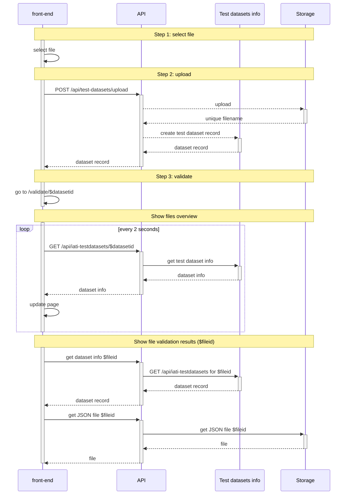
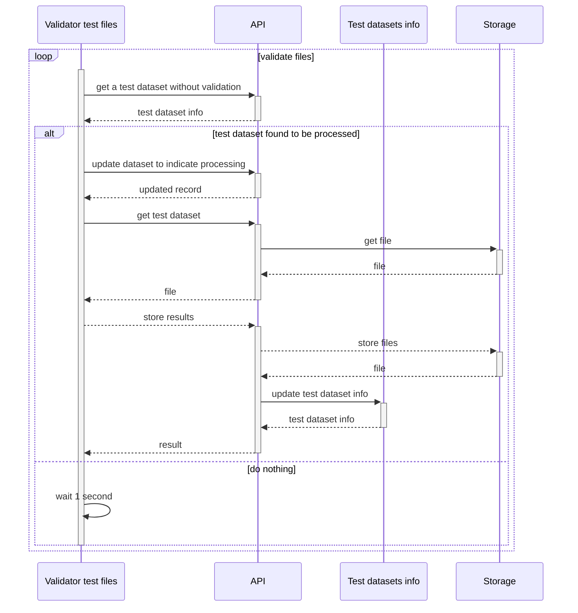

File upload, [see also API doc](https://api-doc.dataworkbench.io/?version=latest#217f2006-7df9-4e5a-8ffe-b4851a737f93)

## Front end component

## Back end component

Runs multiple instances of a loop that asks for a file without validation results, then runs the validation.

The "store results" portion in the diagram is presented as a single action here, but consists of separate steps for each type of feedback file (JSON, SVRL).

